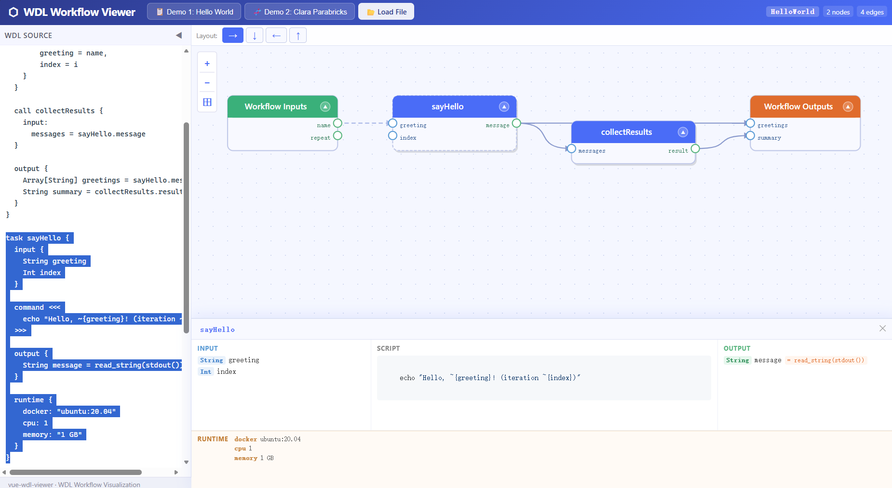

# wdl-viewer

A Vue 3 component library for parsing and visualizing [WDL](https://openwdl.org/) (Workflow Description Language) workflows as interactive graphs.

      

## Development

```bash
# NodeJS v24.13.0
npm test             # run tests
npm run dev          # dev server
npm run build        # build library + demo 
```

## Docker

Builds and serves the demo app with Nginx:

```bash
docker build -t wdl-viewer .
docker run -p 8080:80 wdl-viewer
```

## License

MIT
